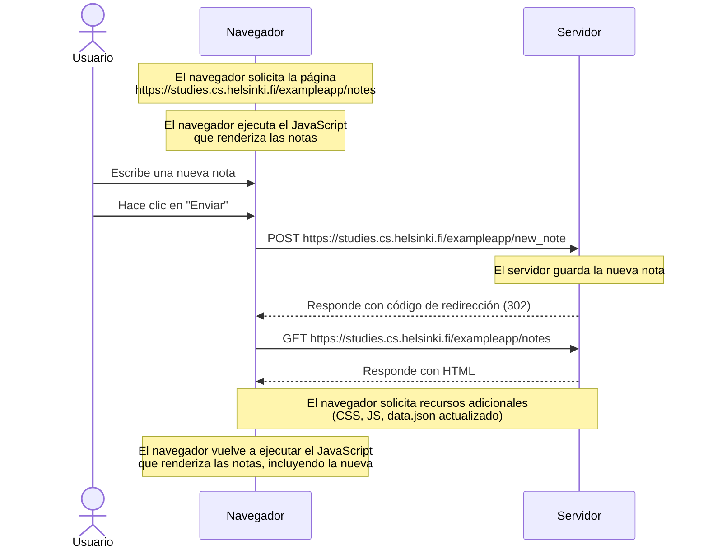

# Diagrama de Secuencia: Usuario enviando una nota

```mermaid
sequenceDiagram
    actor Usuario
    participant Navegador
    participant Servidor

    Note over Navegador: El navegador solicita la página <br/> https://studies.cs.helsinki.fi/exampleapp/notes
    Note over Navegador: El navegador ejecuta el JavaScript<br>que renderiza las notas

    Usuario->>Navegador: Escribe una nueva nota
    Usuario->>Navegador: Hace clic en "Enviar"

    Navegador->>Servidor: POST https://studies.cs.helsinki.fi/exampleapp/new_note
    Note over Servidor: El servidor guarda la nueva nota
    Servidor-->>Navegador: Responde con código de redirección (302)

    Navegador->>Servidor: GET https://studies.cs.helsinki.fi/exampleapp/notes
    Servidor-->>Navegador: Responde con HTML
    
    Note over Navegador,Servidor: El navegador solicita recursos adicionales<br>(CSS, JS, data.json actualizado)

    Note over Navegador: El navegador vuelve a ejecutar el JavaScript<br>que renderiza las notas, incluyendo la nueva
```