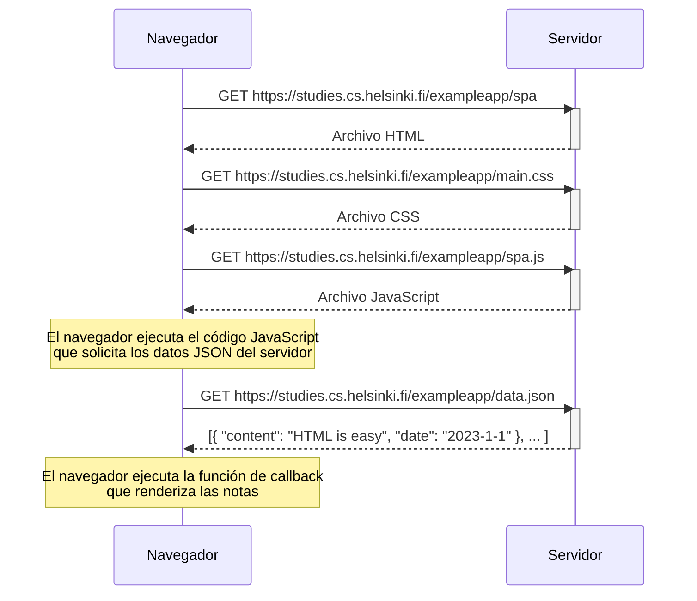

# Diagrama de secuencia: Solicitud de SPA

```mermaid
sequenceDiagram
    participant Navegador
    participant Servidor

    Navegador->>Servidor: GET https://studies.cs.helsinki.fi/exampleapp/spa
    activate Servidor
    Servidor-->>Navegador: Archivo HTML
    deactivate Servidor

    Navegador->>Servidor: GET https://studies.cs.helsinki.fi/exampleapp/main.css
    activate Servidor
    Servidor-->>Navegador: Archivo CSS
    deactivate Servidor

    Navegador->>Servidor: GET https://studies.cs.helsinki.fi/exampleapp/spa.js
    activate Servidor
    Servidor-->>Navegador: Archivo JavaScript
    deactivate Servidor

    Note over Navegador: El navegador ejecuta el código JavaScript<br>que solicita los datos JSON del servidor

    Navegador->>Servidor: GET https://studies.cs.helsinki.fi/exampleapp/data.json
    activate Servidor
    Servidor-->>Navegador: [{ "content": "HTML is easy", "date": "2023-1-1" }, ... ]
    deactivate Servidor

    Note over Navegador: El navegador ejecuta la función de callback<br>que renderiza las notas
```
