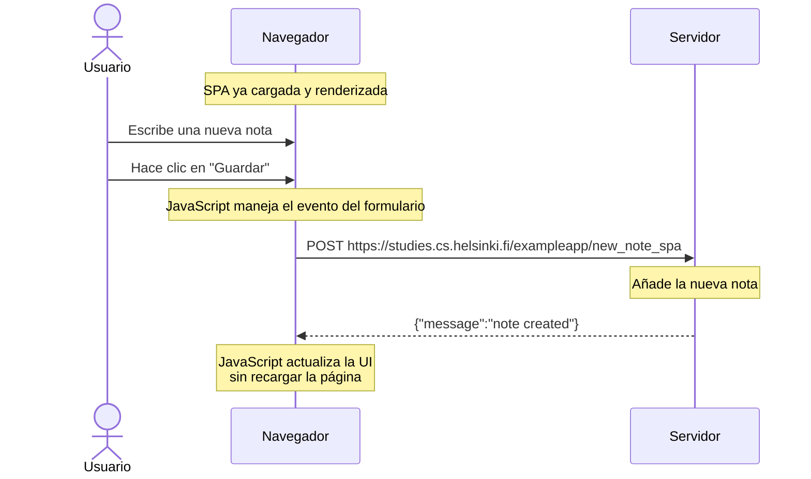

# Diagrama de secuencia: Usuario escribe y guarda una nueva nota en SPA

```mermaid
sequenceDiagram
    actor Usuario
    participant Navegador
    participant Servidor

    Note over Navegador: SPA ya cargada y renderizada

    Usuario->>Navegador: Escribe una nueva nota
    Usuario->>Navegador: Hace clic en "Guardar"
    
    Note over Navegador: JavaScript maneja el evento del formulario

    Navegador->>Servidor: POST https://studies.cs.helsinki.fi/exampleapp/new_note_spa
    Note over Servidor: Añade la nueva nota
    Servidor-->>Navegador: {"message":"note created"}

    Note over Navegador: JavaScript actualiza la UI<br>sin recargar la página
```